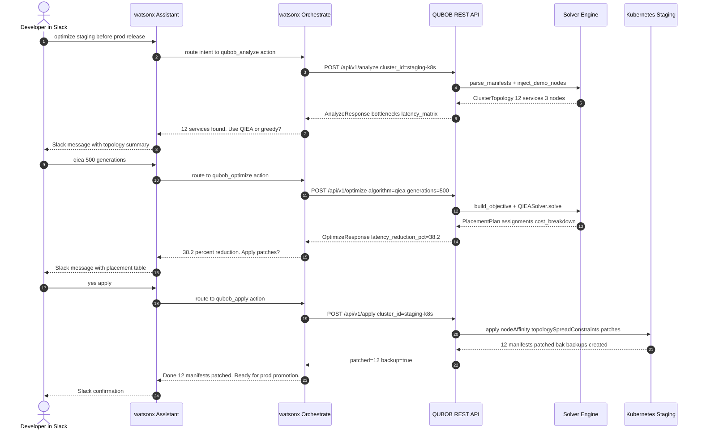
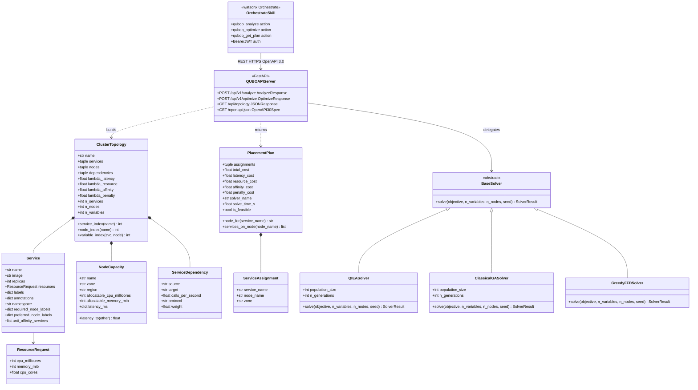

# QUBOB System Architecture

> **QUBOB** — Quantum-Inspired Unconstrained Binary Optimizer for Kubernetes microservice placement.
> This document is the single source of truth for system design, mathematical foundations,
> security posture, and watsonx Orchestrate integration.

---

## Table of Contents

1. [System Overview](#1-system-overview)
2. [Sequence Diagram — End-to-End Flow](#2-sequence-diagram--end-to-end-flow)
3. [Class Diagram — Domain Model & API](#3-class-diagram--domain-model--api)
4. [Mathematical Formulation](#4-mathematical-formulation)
   - 4.1 [QUBO Hamiltonian H_total](#41-qubo-hamiltonian-h_total)
   - 4.2 [Han & Kim Rotation Gate](#42-han--kim-rotation-gate)
   - 4.3 [Shannon Entropy & Catastrophe Operator](#43-shannon-entropy--catastrophe-operator)
5. [Security & Credential Flow](#5-security--credential-flow)
6. [Offline-First Classical CPU Guarantees](#6-offline-first-classical-cpu-guarantees)
7. [Component Reference](#7-component-reference)

---

## 1. System Overview

QUBOB solves the NP-hard microservice-to-node placement problem as a Quadratic Unconstrained
Binary Optimization (QUBO) problem. Given a set of Kubernetes `Deployment` / `StatefulSet`
resources or a `docker-compose.yml`, it finds the binary assignment matrix
`x ∈ {0,1}^{N_services × N_nodes}` that minimises a multi-objective Hamiltonian encoding
latency, resource utilisation, anti-affinity constraints, and a one-hot feasibility penalty.

The optimal plan is translated into production-ready `nodeAffinity` +
`topologySpreadConstraints` patches (Kubernetes) or `deploy.placement.constraints` (Compose),
and exposed over a REST API that watsonx Orchestrate can invoke autonomously.

```
Manifests (k8s YAML / docker-compose.yml)
        │
        ▼
   Parser Layer          kubernetes.py / compose.py
        │                → ClusterTopology (Pydantic, frozen)
        ▼
   QUBO Cost Engine      model/qubo.py
        │                → ObjectiveFn: ndarray → float
        ▼
   Solver Layer
   ┌──────────┬───────────────┬──────────────┐
   │ QIEA     │ Classical GA  │ Greedy FFD   │
   └──────────┴───────────────┴──────────────┘
        │
        ▼
   PlacementPlan (domain.py) → .qubob_plan.json cache
        │
        ▼
   Diff / Patch Layer    k8s_patch.py / compose_patch.py
        │                → nodeAffinity + topologySpreadConstraints
        ▼
   REST API (FastAPI)    dashboard/app.py
        │                POST /api/v1/analyze
        │                POST /api/v1/optimize
        ▼
   watsonx Orchestrate   (external skill, OpenAPI 3.0 import)
        │
        ▼
   watsonx Assistant / Slack
```

---

## 2. Sequence Diagram — End-to-End Flow



---

## 3. Class Diagram — Domain Model & API



---

## 4. Mathematical Formulation

### 4.1 QUBO Hamiltonian H_total

**Source:** [`bob_optimizer/model/qubo.py`](bob_optimizer/model/qubo.py)

#### Variable Encoding

Each binary decision variable `x_{i,j} ∈ {0,1}` encodes whether service `i` is assigned
to node `j`. The flat vector index is:

```
x_{i,j}  ↔  x[ i · N_nodes + j ]
```

with `i ∈ [0, N_services)` and `j ∈ [0, N_nodes)`. Implemented in
`ClusterTopology.variable_index(service_name, node_name)`.

#### One-Hot Constraint

Every service must be assigned to **exactly one** node:

```
∀i:  Σ_j  x_{i,j} = 1
```

Enforced post-observation by `_repair_one_hot(x, n_nodes, rng)` in
[`solvers/qiea.py`](bob_optimizer/solvers/qiea.py).

#### Total Hamiltonian

```
H_total = λ_lat · H_latency
        + λ_res · H_resource
        + λ_aff · H_affinity
        + λ_pen · H_penalty
```

Default λ values (tunable via `ClusterTopology` constructor):

| Parameter        | Default | Purpose                                          |
|------------------|---------|--------------------------------------------------|
| `lambda_latency` | 1.0     | Penalises cross-zone RPC calls weighted by RPS   |
| `lambda_resource`| 10.0    | Penalises CPU/RAM overflows per node             |
| `lambda_affinity`| 5.0     | Penalises anti-affinity violations               |
| `lambda_penalty` | 100.0   | Enforces one-hot assignment feasibility          |

#### Latency Term

```
H_latency = Σ_{(i,k) ∈ E}  w_{ik} · Σ_j Σ_{j'≠j}  x_{i,j} · x_{k,j'} · d(j, j')
```

Where `w_{ik}` is the call rate (RPS) on edge `(i,k)` and `d(j,j')` is the measured RTT
between nodes `j` and `j'` (ms). Vectorised form:

```python
node_lat = x_mat @ latency_mat @ x_mat.T   # shape (n_services, n_services)
H_latency = sum(W * node_lat)              # W = dep_weight_mat
```

Implemented in `_latency_cost()`, [`qubo.py:49`](bob_optimizer/model/qubo.py).

#### Resource Term

```
H_resource = Σ_j  ReLU( Σ_i x_{i,j} · r_i  −  C_j )²
```

Where `r_i` is the CPU demand of service `i` (millicores, scaled by replica count) and
`C_j` is the allocatable CPU of node `j`. Vectorised form:

```python
node_load = x_mat.T @ demands              # shape (n_nodes,)
overflow  = max(node_load - capacities, 0)
H_resource = sum(overflow²)
```

Implemented in `_resource_cost()`, [`qubo.py:86`](bob_optimizer/model/qubo.py).

#### Affinity Term

```
H_affinity = Σ_{(i,k) ∈ anti-affinity}  Σ_j  x_{i,j} · x_{k,j}
```

Non-zero only when two mutually anti-affine services land on the same node.
Implemented in `_affinity_cost()`, [`qubo.py:112`](bob_optimizer/model/qubo.py).

#### Penalty Term (Feasibility)

```
H_penalty = Σ_i  ( Σ_j x_{i,j} − 1 )²
```

Zero for feasible placements (all services assigned to exactly one node). Used as a
soft constraint during solver evolution; should reach ~0 in a valid plan.
Implemented in `_penalty_cost()`, [`qubo.py:136`](bob_optimizer/model/qubo.py).

---

### 4.2 Han & Kim Rotation Gate

**Source:** [`bob_optimizer/solvers/qiea.py`](bob_optimizer/solvers/qiea.py)

**Reference:** Han & Kim, *"Quantum-Inspired Evolutionary Algorithm for a Class of Combinatorial
Optimization"*, IEEE TEC 6(6), 2002.

#### Q-Bit Representation

Each individual in the QIEA population is a **Q-chromosome** — a vector of Q-bits. A single
Q-bit is a probability amplitude pair `(α_i, β_i)` satisfying the normalisation constraint:

```
|α_i|² + |β_i|² = 1
```

where `|α_i|²` = probability of collapsing to 0, `|β_i|²` = probability of collapsing to 1.

**Initialisation:** Equal superposition — `α_i = β_i = 1/√2` for all bits.

**Observation (Monte Carlo collapse):**

```
x_i = 1  with probability |β_i|²
x_i = 0  with probability |α_i|²  =  1 − |β_i|²
```

Implemented in `QBitVector.measure()`, [`qiea.py:95`](bob_optimizer/solvers/qiea.py).

#### Rotation Rule

At each generation, Q-bits are rotated toward the global best solution using the unitary gate:

```
[ α_i' ]   [ cos(Δθ_i)  −sin(Δθ_i) ] [ α_i ]
[ β_i' ] = [ sin(Δθ_i)   cos(Δθ_i) ] [ β_i ]
```

The signed rotation angle `Δθ_i` is determined from the lookup table (Han & Kim Table I),
extended with an **adaptive scale factor**:

```
Δθ_i = adaptive_scale · |table_angle(x_best_i, x_cur_i)|

where:
  adaptive_scale = base_scale × improvement_boost   (if best cost improved last generation)
  adaptive_scale = base_scale                        (otherwise)

  base_scale       = 1.0   (default)
  improvement_boost = 1.5   (default)
```

The `_DELTA_THETA_TABLE` encodes the lookup rule indexed by
`[x_best_i][x_cur_i][improved_flag]`, with values `0.05π` for cases where rotation is
warranted and `0.0` where bits agree. Implemented in `DynamicRotationGate.apply()`,
[`qiea.py:157`](bob_optimizer/solvers/qiea.py).

After rotation, amplitudes are re-normalised to prevent floating-point drift:

```python
norms = sqrt(α² + β²)
α /= norms;  β /= norms
```

---

### 4.3 Shannon Entropy & Catastrophe Operator

**Source:** [`bob_optimizer/solvers/qiea.py`](bob_optimizer/solvers/qiea.py)

#### Population Diversity — Shannon Entropy

The diversity of a Q-chromosome is measured as the mean Shannon entropy across all Q-bits:

```
H(Q) = − (1 / N_bits) · Σ_i [ p_i · log₂(p_i)  +  q_i · log₂(q_i) ]

where:
  p_i = |α_i|²  (probability of bit i = 0)
  q_i = |β_i|²  (probability of bit i = 1)
```

Range: `H ∈ [0, 1]`. Value `1.0` = full superposition (maximum exploration). Value `0.0` = all
Q-bits fully collapsed (pure exploitation, no diversity).

Implemented in `QBitVector.diversity()`, [`qiea.py:114`](bob_optimizer/solvers/qiea.py).

#### Catastrophe Operator — σ_x Phase Flip

When the **mean population diversity** drops below the threshold `δ` (default `0.15`),
the `QuantumCatastropheOperator` applies the Pauli σ_x (NOT) gate to a random fraction
`f` (default `0.30`) of Q-bits in every Q-chromosome:

```
σ_x:  (α_i, β_i)  →  (β_i, α_i)
```

This swaps the probability mass between states 0 and 1, injecting fresh diversity without
destroying the amplitude structure. The operator fires at most once per generation;
`catastrophe_events` is recorded in `SolverResult.metadata`.

**Trigger condition:**

```
mean_H = (1 / pop_size) · Σ_k  H(Q_k)

if mean_H < δ:
    apply σ_x to ⌊f · N_bits⌋ random bits in each Q-chromosome
```

Implemented in `QuantumCatastropheOperator.apply_if_needed()`,
[`qiea.py:234`](bob_optimizer/solvers/qiea.py).

---

## 5. Security & Credential Flow

### Authentication Architecture

```
Developer / Slack App
    │
    │  OAuth 2.0 PKCE  (Slack ↔ IBM Cloud IAM)
    ▼
watsonx Assistant  (IBM Cloud, IAM-authenticated session)
    │
    │  Service-to-service Bearer JWT
    │  (IBM Cloud IAM token, scoped to watsonx Orchestrate instance)
    ▼
watsonx Orchestrate  (external skill invocation)
    │
    │  HTTPS + Bearer token (credential key: QUBOB_API_KEY)
    │  stored in Orchestrate credential vault — never in plaintext
    ▼
QUBOB REST API Server  (FastAPI, TLS termination at load balancer)
    │
    │  cluster_id → path mapping via CLUSTER_REGISTRY
    │  (no raw filesystem paths ever appear in HTTP payloads)
    ▼
bob_optimizer Solver Engine  (in-process, no outbound calls)
```

### Credential Vault Pattern

| Secret | Storage | How Used |
|--------|---------|----------|
| `QUBOB_API_KEY` | Orchestrate credential vault | Bearer token in `Authorization` header |
| `QUBOB_CLUSTER_REGISTRY_JSON` | Environment variable / Kubernetes Secret | Maps `cluster_id` → manifest path |
| IBM Cloud IAM API key | IBM Cloud Secrets Manager | Issues short-lived IAM tokens |

### Path Abstraction

The `CLUSTER_REGISTRY` maps logical `cluster_id` strings to local manifest paths:

```json
{
  "staging-k8s": "/var/manifests/staging",
  "prod-k8s":    "/var/manifests/prod",
  "demo":        "__synthetic__"
}
```

Raw filesystem paths are **never exposed** in API request/response bodies. A request with an
unknown `cluster_id` receives HTTP 404 with a generic message; no path information is leaked.

### TLS & Network Isolation

- TLS termination at the Kubernetes ingress controller (cert-manager / IBM Cloud Load Balancer).
- The FastAPI process binds to `127.0.0.1` (or a pod-internal address); the ingress handles
  public-facing HTTPS.
- No outbound network calls are made by the solver engine — all computation is in-process.

---

## 6. Offline-First Classical CPU Guarantees

QUBOB makes **zero quantum hardware calls** and **zero cloud service calls** during solver
execution. All three solvers run entirely on standard CPUs using NumPy:

| Solver | Algorithm | Hardware Required | Cloud Dependency |
|--------|-----------|------------------|-----------------|
| `QIEASolver` | Quantum-Inspired EA (amplitude vectors + rotation gates) | CPU + NumPy | None |
| `ClassicalGASolver` | Genetic Algorithm (crossover, mutation, tournament) | CPU + NumPy | None |
| `GreedyFFDSolver` | First-Fit Decreasing heuristic | CPU only | None |

**"Quantum-inspired"** means the algorithm borrows the mathematical abstraction of quantum
amplitude superposition and unitary rotation to drive probabilistic search. No quantum
annealer, QPU, D-Wave system, or cloud quantum service is involved.

**Air-gapped deployment:** The QUBOB API server can run in a fully network-isolated environment.
The only external network traffic is inbound HTTPS from watsonx Orchestrate. The solver
engine, parsers, and patch generator all operate on local filesystem manifests.

**Reproducibility:** All solvers accept an integer `seed` parameter that is passed to
`np.random.default_rng(seed)`. Given the same manifests, same algorithm, same seed, and
same generation count, the output `PlacementPlan` is **bit-for-bit identical** across runs.

---

## 7. Component Reference

| Class / Module | Source File | Role |
|----------------|-------------|------|
| `ClusterTopology` | `bob_optimizer/model/domain.py` | Primary input to QUBO and all solvers |
| `Service` | `bob_optimizer/model/domain.py` | Single deployable microservice unit |
| `NodeCapacity` | `bob_optimizer/model/domain.py` | Physical/virtual Kubernetes node |
| `ServiceDependency` | `bob_optimizer/model/domain.py` | Directed RPS-weighted call edge |
| `PlacementPlan` | `bob_optimizer/model/domain.py` | Solver output with assignments + costs |
| `ServiceAssignment` | `bob_optimizer/model/domain.py` | Single service-to-node assignment |
| `ResourceRequest` | `bob_optimizer/model/domain.py` | CPU/memory resource spec |
| `build_objective` | `bob_optimizer/model/qubo.py` | Constructs vectorised QUBO cost closure |
| `decompose_cost` | `bob_optimizer/model/qubo.py` | Returns per-term cost breakdown |
| `QIEASolver` | `bob_optimizer/solvers/qiea.py` | Primary solver — QIEA with adaptive rotation |
| `ClassicalGASolver` | `bob_optimizer/solvers/baseline_ga.py` | Baseline GA solver |
| `GreedyFFDSolver` | `bob_optimizer/solvers/greedy.py` | Sub-second deterministic heuristic |
| `BaseSolver` | `bob_optimizer/solvers/base.py` | Abstract solver interface + `SolverResult` |
| `QBitVector` | `bob_optimizer/solvers/qiea.py` | Q-chromosome with amplitude pairs |
| `DynamicRotationGate` | `bob_optimizer/solvers/qiea.py` | Han & Kim U(Δθ) rotation gate |
| `QuantumCatastropheOperator` | `bob_optimizer/solvers/qiea.py` | σ_x diversity injection operator |
| `parse_manifests` | `bob_optimizer/parser/kubernetes.py` | Kubernetes YAML → ClusterTopology |
| `parse_compose` | `bob_optimizer/parser/compose.py` | docker-compose.yml → ClusterTopology |
| `build_latency_matrix` | `bob_optimizer/model/graph.py` | Constructs N×N RTT matrix |
| `create_app` | `bob_optimizer/dashboard/app.py` | FastAPI application factory |
| `run_dashboard` | `bob_optimizer/dashboard/app.py` | Standalone uvicorn launcher |
| `cli` | `bob_optimizer/cli/main.py` | Click CLI group (`bob-opt`) |
| `openapi_spec.json` | `watsonx/openapi_spec.json` | Standalone OpenAPI 3.0.3 import artefact |
| `qubob_orchestrate_skill.json` | `watsonx/qubob_orchestrate_skill.json` | Orchestrate skill descriptor |
